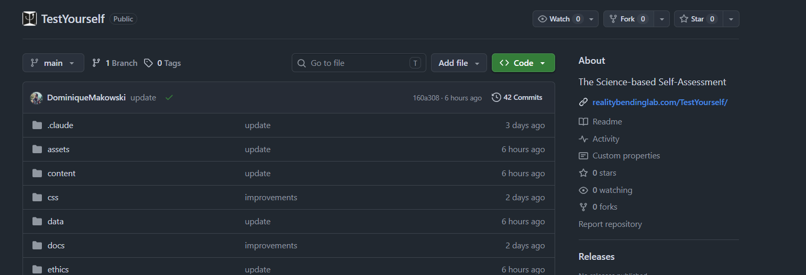
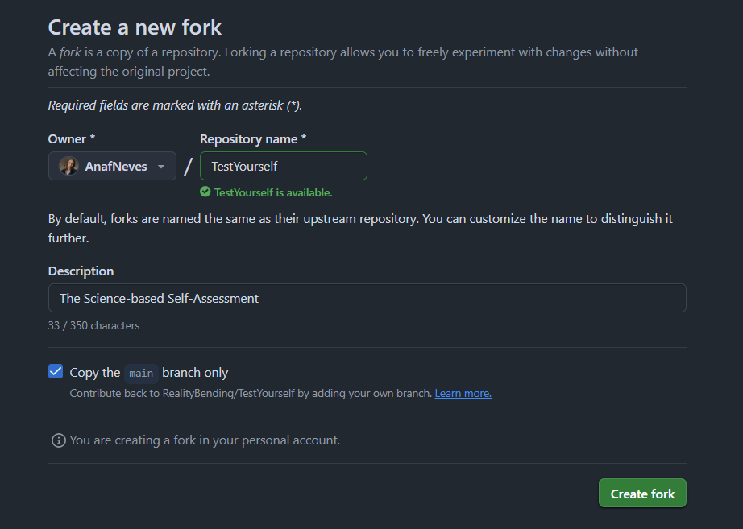
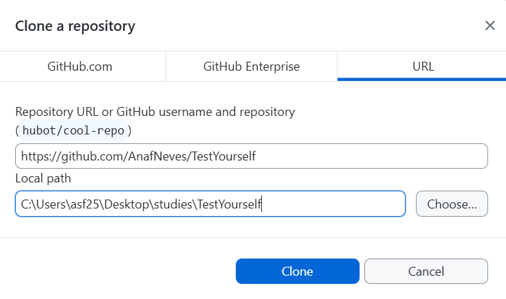
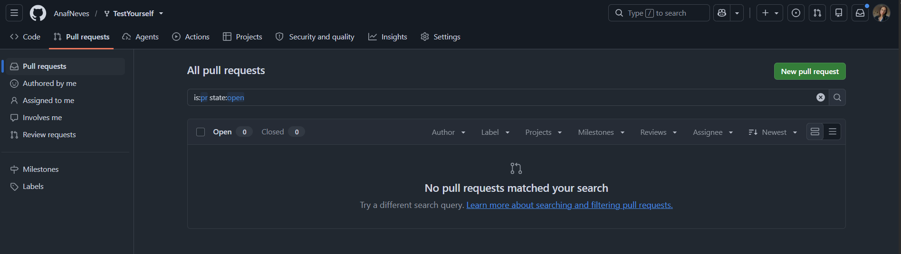
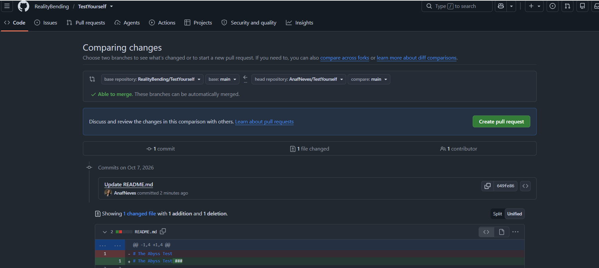
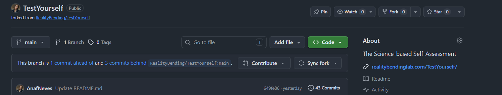

<!--
  Colours used throughout:
    Git    = #F05032 (orange, from the Git logo)
    GitHub = #191970 (midnight blue)

  Screenshots sit inside the bullet they belong to, so they appear on the
  same click. Each one covers the previous one in the same spot on the right.
-->

## Today

::: {.nonincremental}

1. **Why** use Git and GitHub?
2. **Key ideas**: the words you'll hear
3. **Getting set up** with GitHub Desktop
4. **The workflow**: fork, commit, push, pull request
5. **Hands-on**: add a memory to the REBEL website
:::

. . .

No prior experience needed. Ask questions at any time!

# Why bother? {background-color="#191970"}

## Sound familiar?

:::: {.columns}

::: {.column width="50%"}
**Without Git**

- `analysis.R`
- `analysis_v2.R`
- `analysis_v2_final.R`
- `analysis_v2_final_REALLY.R`
- `analysis_USE_THIS_ONE.R` 
:::

::: {.column width="50%"}
**With Git**

- One file: `analysis.R`
- Every version saved, with a note on **what** changed and **why**
- Go back to any point in time
:::

::::

## What you get

- **A backup** of your work in the cloud
- **A time machine**: undo mistakes, see old versions
- **Teamwork** without overwriting each other
- **Open science**: share code and data with one link
- **Free websites** with GitHub Pages (e.g., [The REBEL lab](https://realitybendinglab.com/))

# Key ideas {background-color="#191970"}

## Git vs GitHub

:::: {.columns}

::: {.column width="50%"}
[**Git**]{style="color: #F05032;"}

- A **program**
- Installed on **your computer**
- Tracks every change to your files (*version control*)
:::

::: {.column width="50%"}
[**GitHub**]{style="color: #191970;"}

- A **website**
- Stores your projects **online** (in the cloud)
- For sharing and collaborating
:::
::::

## An analogy with R

| | The engine | The friendly interface |
|---|---|---|
| **Analysing data** | R | RStudio |
| **Version control** | [Git]{style="color: #F05032;"} | [GitHub Desktop]{style="color: #191970;"} |
<br><br>

- The **engine** does the work; the **interface** gives you buttons instead of commands
- GitHub Desktop comes with Git built in, so you only install **one** thing
- [GitHub]{style="color: #191970;"} (the website) is where your projects live online

## Vocabulary

| Term | What it means | Where |
|------|---------------|-------|
| **Repository** (repo) | A project folder tracked by Git | Both |
| **Fork** | Your own copy of someone else's repo | github.com |
| **Clone** | Copy a repo from GitHub to your computer | GitHub Desktop |
| **Commit** | A saved snapshot of your files | GitHub Desktop |
| **Push** | Send your commits to GitHub | GitHub Desktop |
| **Pull** | Get new commits from GitHub | GitHub Desktop |
| **Pull request** (PR) | Ask the owner to add your changes | github.com |

# Getting set up {background-color="#191970"}

## Setup

::: {.nonincremental}
1. Create a free account at [github.com](https://github.com)
2. Install [GitHub Desktop](https://desktop.github.com)
3. Open it and **sign in** with your GitHub account
4. Check your name and email:
   - Windows: **File ➜ Options ➜ Git**
   - Mac: **GitHub Desktop ➜ Settings ➜ Git**
:::

## A quick tour

:::: {.columns}

::: {.column width="30%"}
::: {.nonincremental}
[1. **Left side**: all the repos]{.fragment fragment-index=1}

[2. **Top bar**: repository, branch, Push / Pull]{.fragment fragment-index=3}

[3. **Changes**: what you've edited]{.fragment fragment-index=5}

[4. **Bottom left**: write a message, commit]{.fragment fragment-index=6}

[5. **History**: all past commits]{.fragment fragment-index=7}
:::
:::

::: {.column width="70%"}
::: {.r-stack}
{.fragment fragment-index=2}

{.fragment fragment-index=4}

{.fragment fragment-index=8}
:::
:::

::::

# The workflow {background-color="#191970"}

## The big picture

```{mermaid}
%%| fig-width: 10
flowchart LR
  A[(Original repo)] -- ① Fork --> B[(Your fork)]
  B -- ② Clone --> C[Your computer]
  C -- ③ Commit &amp; ④ Push --> B
  B -- ⑤ Pull request --> A
```

. . .

::: {.callout-tip}
Commit little and often. Push at least at the **end of every day**.
:::

## 1. Fork the repo

A **fork** is a copy of a repository under **your** account. Use it when you **can't** edit the original.

:::: {.columns}

::: {.column width="30%"}
::: {.nonincremental}
[1. On github.com, open the original repo and click **Fork** (top right)]{.fragment fragment-index=1}

[2. Keep the name and click **Create fork**]{.fragment fragment-index=3}
:::
:::

::: {.column width="70%"}
::: {.r-stack}
{.fragment fragment-index=2}

{.fragment fragment-index=4}
:::
:::

::::

- You now have your own copy: whatever you do there, the original stays untouched

## 2. Clone your fork

In GitHub Desktop:

:::: {.columns}

::: {.column width="40%"}
::: {.nonincremental}
[1. **File ➜ Clone repository**]{.fragment fragment-index=1}

[2. Choose the **URL** tab and paste **your fork's** URL (it has *your* username)]{.fragment fragment-index=3}

[3. Choose a **Local path** and click **Clone**]{.fragment fragment-index=5}
:::
:::

::: {.column width="60%"}
::: {.r-stack}
{.fragment fragment-index=2}

{.fragment fragment-index=4}
:::
:::

::::

## 3. Commit your changes

:::: {.columns}

::: {.column width="30%"}
::: {.nonincremental}
[1. Edit and save your files as usual]{.fragment fragment-index=1}

[2. Check the **Changes** tab]{.fragment fragment-index=3}

[3. Write a **Summary**]{.fragment fragment-index=4}

[4. Click **Commit to main**]{.fragment fragment-index=5}

[5. The button now says **Push origin**]{.fragment fragment-index=6}
:::
:::

::: {.column width="70%"}
::: {.r-stack}
{.fragment fragment-index=2}

{.fragment fragment-index=7}
:::
:::

::::

## Good vs bad commit messages {.smaller}

:::: {.columns}

::: {.column width="50%"}
❌ **Bad**

- `update`
- `stuff`
- `asdfgh`
- `final version`
:::

::: {.column width="50%"}
✅ **Good**

- `Add age to demographics table`
- `Fix typo in methods section`
- `Remove outliers above 3 SD`
- `Update figure 2 colours`
:::

::::

. . .

> Future you will thank you!

## 4. Push to your fork

:::: {.columns}

::: {.column width="30%"}
::: {.nonincremental}
[1. Click **Push origin**]{.fragment fragment-index=1}

[2. Refresh **your fork** on github.com: your changes are there 🎉]{.fragment fragment-index=2}
:::
:::

::: {.column width="70%"}
::: {.r-stack}
{.fragment fragment-index=3}
:::
:::

::::

## 5. Open a pull request

A **pull request** (PR) asks the owner of the original repo to add your changes.

:::: {.columns}

::: {.column width="40%"}
::: {.nonincremental}
[1. On github.com, go to **your fork** ➜ **Pull requests** ➜ **New pull request**]{.fragment fragment-index=1}

[2. Check the arrow: **base** = the original ⬅ **head** = your fork, then click **Create pull request**]{.fragment fragment-index=3}

[3. The owner reviews, comments 💬 and **merges** ✅]{.fragment fragment-index=5}
:::
:::

::: {.column width="60%"}
::: {.r-stack}
{.fragment fragment-index=2}

{.fragment fragment-index=4}
:::
:::

::::

## 6. Keep your fork up to date

The original repo keeps changing. Before you start working:

:::: {.columns}

::: {.column width="40%"}
::: {.nonincremental}
[1. On github.com, open **your fork** and click **Sync fork ➜ Update branch**]{.fragment fragment-index=1}

[2. In GitHub Desktop, click **Fetch origin**]{.fragment fragment-index=3}

[3. If there's anything new, click **Pull origin**]{.fragment fragment-index=5}
:::
:::

::: {.column width="60%"}
::: {.r-stack}
{.fragment fragment-index=2}

{.fragment fragment-index=4}

{.fragment fragment-index=6}
:::
:::

::::

::: {.fragment fragment-index=7}
> In GitHub Desktop, **origin** means **your fork**, not the original repo. So **Pull origin** only downloads what's already on your fork. If your fork is behind the original, there's nothing new on it to pull. **Sync fork** brings your fork up to date with the original first. Then **Pull origin** brings those changes down to your computer.
:::


## Files you shouldn't share

Large data, outputs, passwords...

- In the **Changes** tab, right-click the file
- Choose **Ignore file** (or **Ignore all .xxx files**)
- GitHub Desktop writes a `.gitignore` file for you

# Hands-on {background-color="#191970"}

## Your turn: add a memory to the REBEL website

:::: {.columns}

::: {.column width="40%"}
::: {.nonincremental}
[1. **Fork** the [REBEL website repo](https://github.com/RealityBending/RealityBending.github.io)]{.fragment fragment-index=1}

[2. **Clone** your fork with GitHub Desktop]{.fragment fragment-index=2}

[3. Open the image folder under the memories folder]{.fragment fragment-index=3}

[4. Add an image from the dinner/pub from last Monday (follow the same naming specification)]{.fragment fragment-index=4}

[5. Open the `memories_manifest.json` file and add the information about the image]{.fragment fragment-index=5}

[6. **Commit** with a good message and **push** to your fork]{.fragment fragment-index=7}

[7. Open a **pull request** to `RealityBending/RealityBending.github.io` 🎉]{.fragment fragment-index=8}
:::
:::

::: {.column width="60%"}
{.fragment fragment-index=6}
:::

::::

# Extras {background-color="#191970"}

## Create your own repository

On [github.com](https://github.com):

:::: {.columns}

::: {.column width="30%"}
::: {.nonincremental}
[1. Click **New**]{.fragment fragment-index=1}

[2. Give it a name]{.fragment fragment-index=3}

[3. Tick **Add a README file**]{.fragment fragment-index=5}

[4. Click **Create repository**]{.fragment fragment-index=6}
:::
:::

::: {.column width="70%"}
::: {.r-stack}
{.fragment fragment-index=2}

{.fragment fragment-index=4}
:::
:::

::::

- Then clone it, commit and push as usual: no fork needed, it's yours!

## Branch or fork? {.smaller}

| | Branch | Fork |
|---|---|---|
| **Where** | Inside the **same** repo | A **separate** copy on your account |
| **Who** | People with access to the repo | Anyone |
| **When** | Trying something in your own or your team's project | Contributing to someone else's project |

## Branches: try things safely

```{mermaid}
%%| fig-width: 10
gitGraph
  commit
  commit
  branch new-idea
  checkout new-idea
  commit
  commit
  checkout main
  merge new-idea
  commit
```

- **Current branch ➜ New branch**, then **Publish branch**
- `main` stays safe while you experiment

## Going back in time {.smaller}

| What happened | What to do in GitHub Desktop |
|---|---|
| Changed a file, **not committed** | **Changes** ➜ right-click file ➜ **Discard changes** |
| Committed, **not pushed** | **History** ➜ right-click commit ➜ **Undo commit** |
| Already **pushed** | **History** ➜ right-click commit ➜ **Revert changes in commit** ➜ **Push** |
| Just want to **look** at an old version | github.com ➜ open the file ➜ **History** |

. . .

::: {.callout-tip}
Git never forgets: reverting adds a new snapshot that cancels the old one.
:::

## When things go wrong {.smaller}

| Problem | What to do |
|---------|-----------|
| Push is rejected | Someone else pushed first: **Pull**, then **Push** again |
| Conflict (same lines changed by two people) | GitHub Desktop shows the files: pick which version to keep, then commit |
| Committed the wrong thing | **History** ➜ right-click the commit ➜ **Revert changes in commit** |
| File too big | Don't commit it: **Ignore** it instead |

## Resources

- [GitHub Desktop documentation](https://docs.github.com/en/desktop)
- [GitHub Docs](https://docs.github.com)
- [GitHub Skills](https://skills.github.com): free interactive courses

## Questions? {.center background-color="#191970"}

{fig-align="center" width="120" style="filter: invert(1);"}

