<!--
  Colours used throughout:
    Git    = #F05032 (orange, from the Git logo)
    GitHub = #191970 (midnight blue)

  Screenshots sit inside the bullet they belong to, so they appear on the
  same click. Each one covers the previous one in the same spot on the right.
-->

## Today

::: {.nonincremental}
1. **Why** use Git and GitHub?
2. **Key ideas**: the words you'll hear
3. **GitHub Desktop**: the everyday workflow
4. **Collaborating** with others
5. **Hands-on**: your first repository
:::

. . .

No prior experience needed. Ask questions at any time!

# Why bother? {background-color="#191970"}

## Sound familiar?

:::: {.columns}

::: {.column width="50%"}
**Without Git**

- `analysis.R`
- `analysis_v2.R`
- `analysis_v2_final.R`
- `analysis_v2_final_REALLY.R`
- `analysis_USE_THIS_ONE.R` 
:::

::: {.column width="50%"}
**With Git**

- One file: `analysis.R`
- Every version saved, with a note on **what** changed and **why**
- Go back to any point in time
:::

::::

## What you get

- **A backup** of your work in the cloud
- **A time machine**: undo mistakes, see old versions
- **Teamwork** without overwriting each other
- **Open science**: share code and data with one link
- **Free websites** with GitHub Pages (e.g., [The REBEL lab](https://realitybendinglab.com/))

# Key ideas {background-color="#191970"}

## Git vs GitHub

:::: {.columns}

::: {.column width="50%"}
[**Git**]{style="color: #F05032;"}

- A **program**
- Installed on **your computer**
- Tracks every change to your files (*version control*)
:::

::: {.column width="50%"}
[**GitHub**]{style="color: #191970;"}

- A **website**
- Stores your projects **online** (in the cloud)
- For sharing and collaborating
:::

::::

## An analogy with R {.smaller}

| | The engine | The friendly interface |
|---|---|---|
| **Analysing data** | R | RStudio |
| **Version control** | [Git]{style="color: #F05032;"} | [GitHub Desktop]{style="color: #191970;"} |

- The **engine** does the work; the **interface** gives you buttons instead of commands
- GitHub Desktop comes with Git built in, so you only install **one** thing
- [GitHub]{style="color: #191970;"} (the website) is where your projects live online

## Vocabulary {.smaller}

| Term | What it means | In GitHub Desktop |
|------|---------------|-------------------|
| **Repository** (repo) | A project folder tracked by Git | *Current repository* |
| **Commit** | A saved snapshot of your files | *Commit to main* |
| **Push** | Send your commits to GitHub | *Push origin* |
| **Pull** | Get new commits from GitHub | *Pull origin* |
| **Clone** | Copy a repo from GitHub to your computer | *File ➜ Clone repository* |
| **Branch** | A parallel copy to try things safely | *Current branch* |

## The everyday cycle

```{mermaid}
%%| fig-width: 10
flowchart LR
  A[Pull] --> B[Edit]
  B --> C[Commit]
  C --> D[Push]
  D --> E[(GitHub)]
  E --> A
```
. . .

::: {.callout-tip}
Commit little and often. Push at least at the **end of every day**.
:::

# GitHub Desktop {background-color="#191970"}

## Setup

::: {.nonincremental}
1. Create a free account at [github.com](https://github.com)
2. Install [GitHub Desktop](https://desktop.github.com)
3. Open it and **sign in** with your GitHub account
4. Check your name and email:
   - Windows: **File ➜ Options ➜ Git**
   - Mac: **GitHub Desktop ➜ Settings ➜ Git**
:::

## A quick tour

- **Left side**: all the repos

    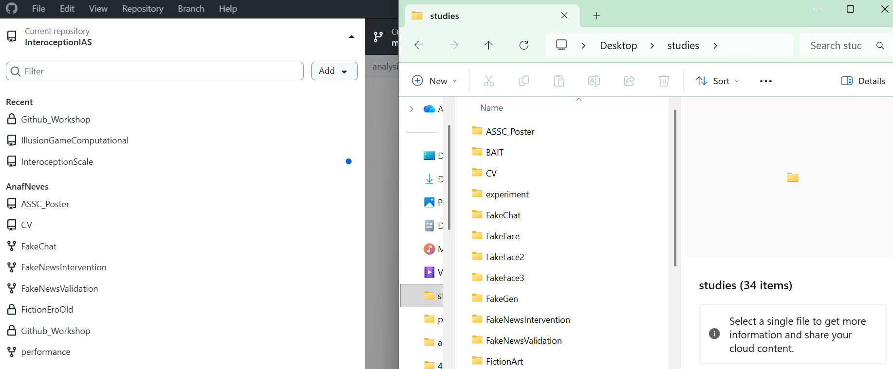{width="50%"}

- **Top bar**: repository, branch, Push / Pull
- **Changes**: what you've edited
- **Bottom left**: write a message, commit

    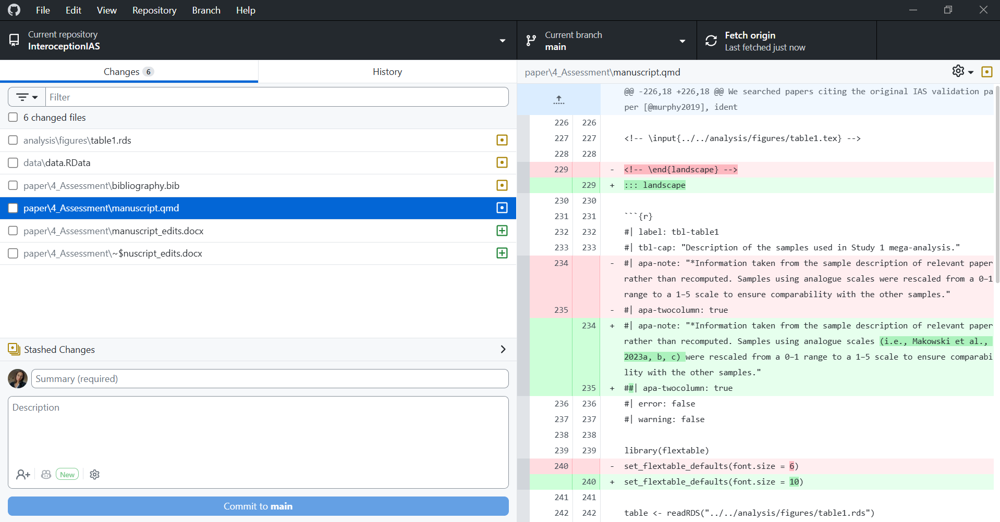{width="50%"}

- **History**: all past commits

    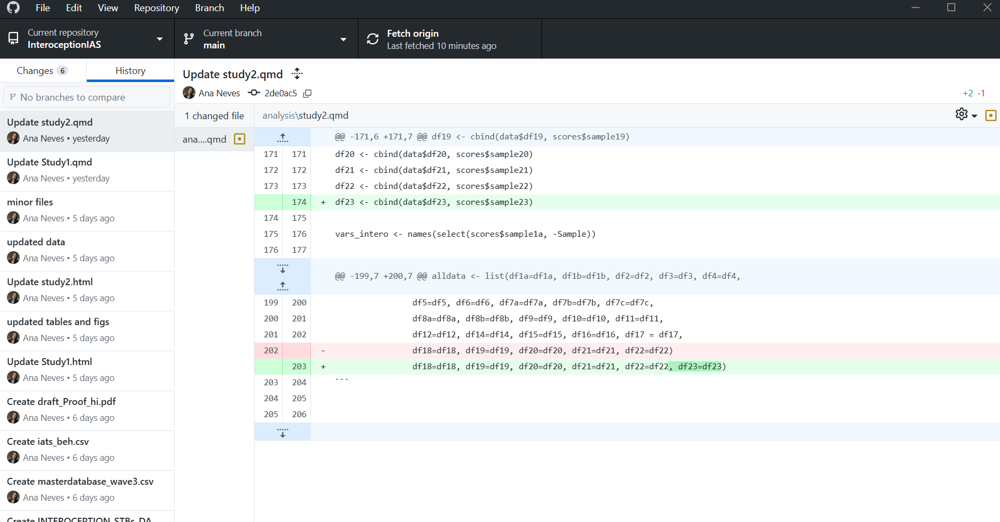{width="50%"}

## 1. Create a repository

On [github.com](https://github.com):

- Click **New**

    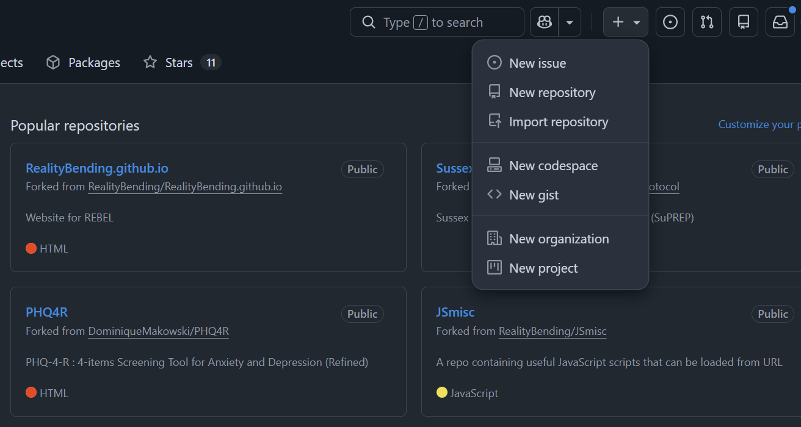{width="50%"}
    
- Give it a name
- Tick **Add a README file**
- Click **Create repository**

    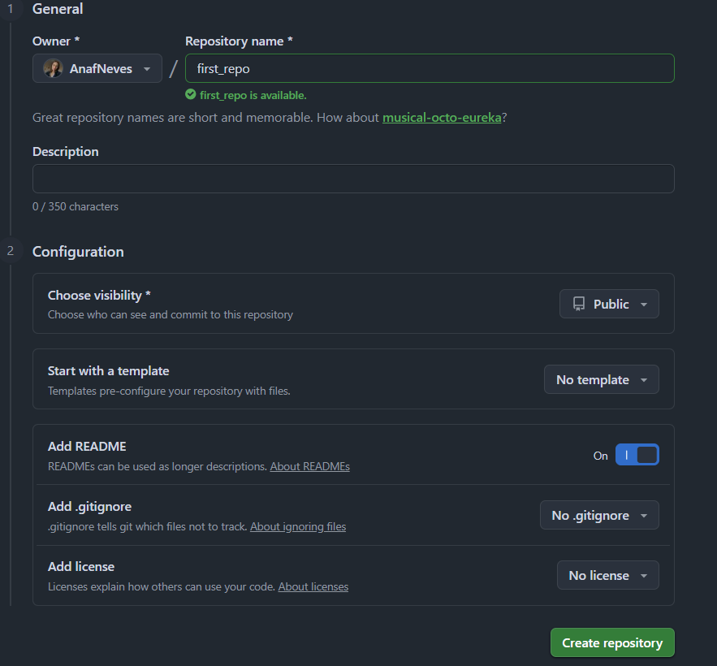{width="50%"}

## 2. Clone it to your computer

- Most likely you will have to clone existing repos from the [Realitybending](https://github.com/RealityBending){.smaller}

In GitHub Desktop:

- **File or Add ➜ Clone repository**

    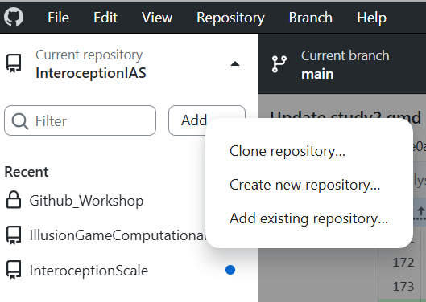{width="50%"}
    
- Pick your repository (I prefer to use the URL option)
- Choose a **Local path**
- Click **Clone**

    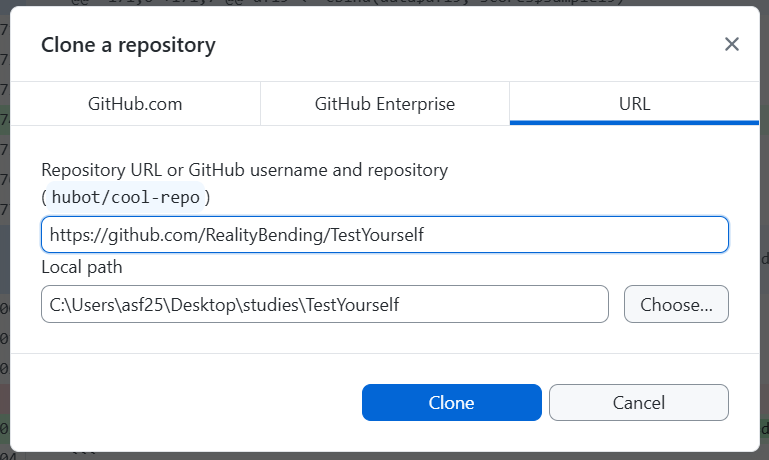{width="50%"}
  

## 3. Commit your changes 

- Edit and save your files as usual
- Check the **Changes** tab
- Write a **Summary**
- Click **Commit to main**

    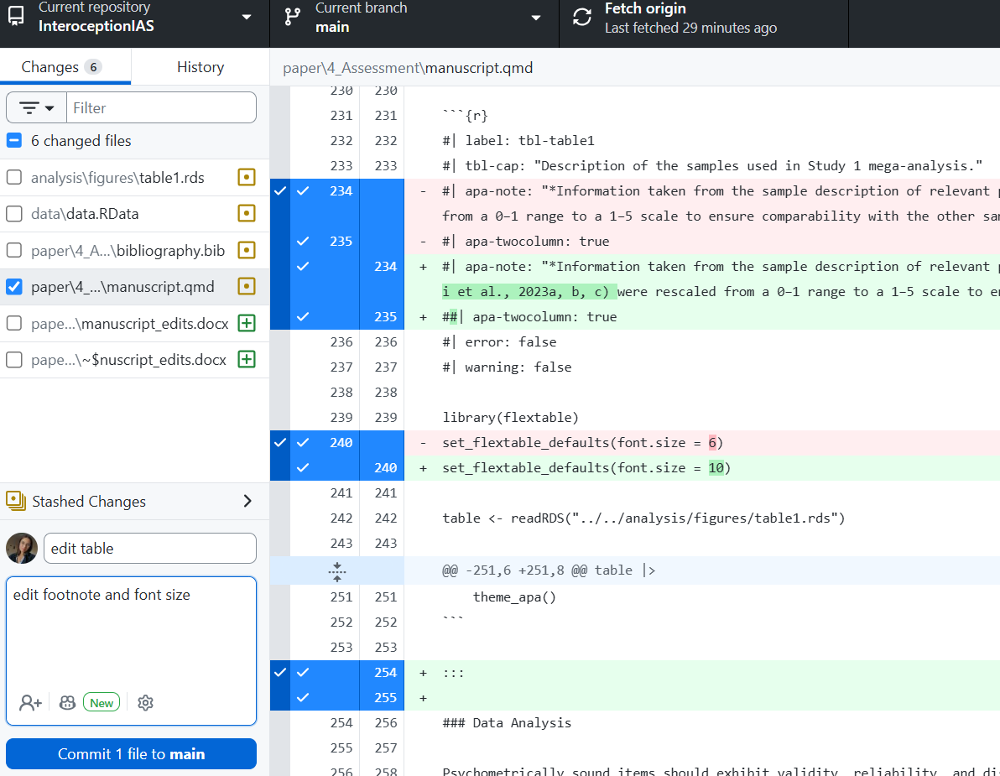{width="50%"}
    
- The button now says **Push origin**

    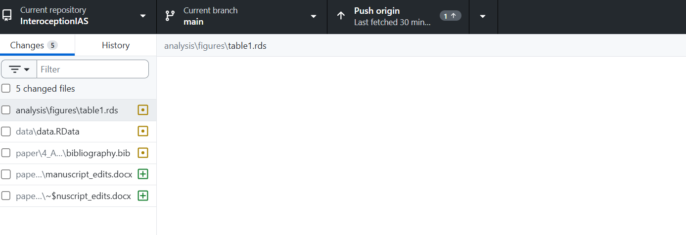{width="50%"}

## Good vs bad commit messages {.smaller}

:::: {.columns}

::: {.column width="50%"}
❌ **Bad**

- `update`
- `stuff`
- `asdfgh`
- `final version`
:::

::: {.column width="50%"}
✅ **Good**

- `Add age to demographics table`
- `Fix typo in methods section`
- `Remove outliers above 3 SD`
- `Update figure 2 colours`
:::

::::

. . .

> Future you will thank you!

## 4. Push to GitHub 

- Refresh github.com: your changes are there 🎉

    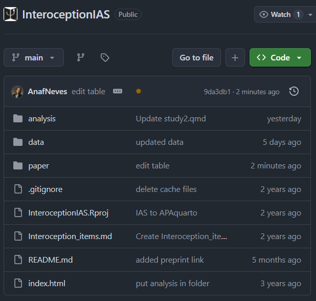{width="50%"}

## 5. Pull changes 

- Check whether changes have been made that you `do not have` on your computer

    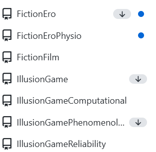{width="50%"}
    
- If there's anything new, click **Pull origin**

    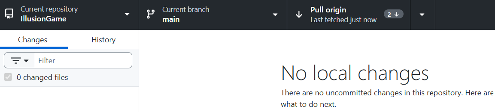{width="50%"}
    
- **Always pull before you start working!**

## Files you shouldn't share

Large data, outputs, passwords...

- In the **Changes** tab, right-click the file
- Choose **Ignore file** (or **Ignore all .xxx files**)
- GitHub Desktop writes a `.gitignore` file for you

# Collaborating {background-color="#191970"}

## Branches: try things safely

```{mermaid}
%%| fig-width: 10
gitGraph
  commit
  commit
  branch new-idea
  checkout new-idea
  commit
  commit
  checkout main
  merge new-idea
  commit
```

- **Current branch ➜ New branch**, then **Publish branch**
- `main` stays safe while you experiment

## Pull requests: "please add my changes"

1. Commit and push on your branch
2. Click **Create Pull Request** (opens github.com)
3. Others review and comment 
4. **Merge** into `main` 

## When things go wrong {.smaller}

| Problem | What to do |
|---------|-----------|
| Push is rejected | Someone else pushed first: **Pull**, then **Push** again |
| Conflict (same lines changed by two people) | GitHub Desktop shows the files: pick which version to keep, then commit |
| Committed the wrong thing | **History** ➜ right-click the commit ➜ **Revert changes in commit** |
| File too big | Don't commit it: **Ignore** it instead |

# Hands-on {background-color="#191970"}

## Your turn!

::: {.nonincremental}
1. Create a repository on github.com
2. Clone it with GitHub Desktop
3. Open `README.md` and write something about yourself
4. Commit with a good message
5. Push ⬆
6. Check it on github.com 
:::

. . .

**Bonus:** make a second change, commit, push, and look at the **History** tab.

## Your actual real turn!
::: {.nonincremental}
1. Clone the repo for the [Rebel Website](https://github.com/RealityBending/RealityBending.github.io)
2. Open the image folder under the memories folder
3. Add an image from the dinner/pub from last Monday (follow the same naming specification)
4. Open the memories_manifest.json file 

    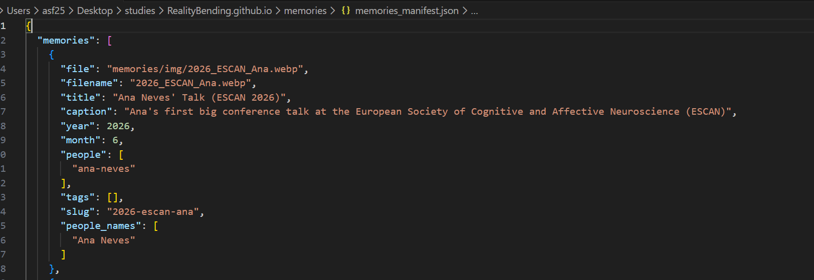{width="50%"}
5. Add the information about the image
6. Push
7. Check it on github.com 
:::


## Resources

- [GitHub Desktop documentation](https://docs.github.com/en/desktop)
- [GitHub Docs](https://docs.github.com)
- [GitHub Skills](https://skills.github.com): free interactive courses

## Questions? {.center background-color="#191970"}

{fig-align="center" width="120" style="filter: invert(1);"}
